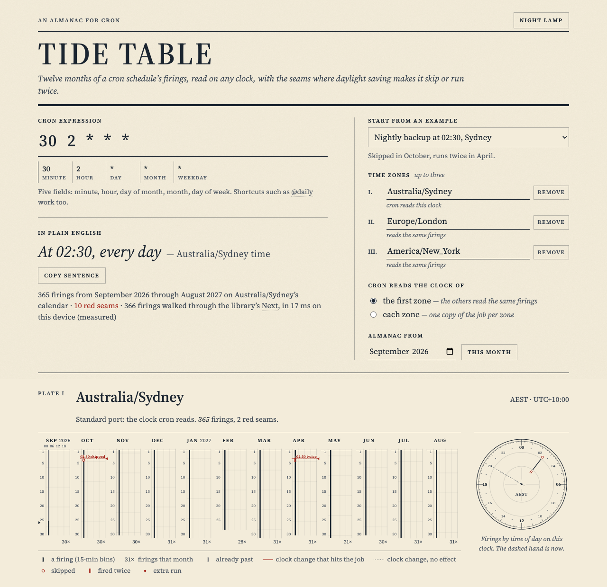

# Tide Table

**Paste a cron expression; see the next year of firings as an almanac across time zones.**



Tide Table reads a cron schedule the way a tide table reads the sea: twelve month columns, a fine tick for every firing, and a plain sentence for what it does. Where daylight saving tears the schedule, a red seam runs across the page. That is the day a job is skipped because its time never happens, or runs twice because its time happens twice, or reads an hour earlier or later on someone else's clock.

The firings come from [robfig/cron v3](https://github.com/robfig/cron), the Go library Kubernetes uses to parse CronJob schedules. It is compiled with the rest of the engine to WebAssembly and runs in your browser, so the page shows that library's behaviour, not a re-implementation of it.

## The 30-second experience

1. Type an expression such as `0 9 * * 1-5` or `30 2 * * *`, or pick an example.
2. Pick one to three IANA time zones, such as `Australia/Sydney`, `Europe/London` or `America/New_York`.
3. Choose whose clock cron reads:
   - **the first zone**, with the others reading the same firings (a server in Sydney, seen from London and New York);
   - or **each zone**, with one copy of the job per zone.
4. Read the result:
   - **A plain-English sentence**, such as "At 09:00, Monday through Friday", with a copy button.
   - **A plate for each zone**, with:
     - **a year strip** in almanac style: twelve month columns, a row per day, midnight to midnight across, a tick at each firing and the month's total underneath;
     - **red seams** where a clock change hits the job, each with its short label printed beside it ("02:30 skipped"): a hollow ring where a firing was skipped, a double tick where it ran twice, a red dot for an extra run the library adds, and a plain red seam where the readings shift on a secondary zone;
     - **a polar 24-hour dial**, engraved, beside the strip on wide screens, with a tick at each time of day that fires, long in proportion to how many days fire then, and a dashed hand at "now";
     - **the next ten firings** on that zone's clock, flagging both runs of a repeated time.

The state lives in the URL, so a link reopens the same almanac.

## What it models, exactly

Cron implementations disagree about clock changes. Tide Table models **robfig/cron v3.0.1** and says so on the page.

| When | robfig/cron (modelled here) | cronie / Vixie cron, for comparison |
| --- | --- | --- |
| Clocks go forward (a gap) | A firing whose wall time falls in the gap is **skipped**. The library's docs: "jobs scheduled during daylight-savings leap-ahead transitions will not be run!" | Jobs from the skipped interval "will be run immediately" after the change, for fixed-time jobs and changes under three hours ([cron(8)](https://github.com/cronie-crond/cronie/blob/master/man/cron.8)). |
| Clocks go back (an overlap) | A firing whose wall time falls in the repeated interval **runs twice**, once in each pass (its own tests call this "1am nightly job (runs twice)"). | "running the same job twice is avoided". |
| Frequent jobs (every few minutes) | Walked minute by minute on the wall clock: the gap's minutes are skipped and the overlap's minutes run twice. | Scheduled normally. |
| Changes that aren't a whole hour, or aren't on the hour (Lord Howe Island's 30 minutes; the Chatham Islands at 02:45) | A quirk of its search, which steps an hour at a time: after the change its steps land off the hour. `0 12 * * *` in Lord Howe is **skipped on both change days**, though 12:00 happens; `30 1 * * *` gets an **extra run** at 02:30; `50 3 * * *` in Chatham skips 03:50 in September. A search that crosses such a change can also pass over a time days later (`@monthly` in Lord Howe loses 1 November in 2028). | Not affected: cron checks each minute. |
| Chatham Islands, clocks going back, minutes :45–:59 of hour 3 (2024–2199) | `Next` of 02:50 returns 02:50 again, so a running scheduler would **re-fire in a tight loop** until 03:00. The page shows that run once and says so, then carries on from the next minute. | — |

The engine doesn't assume those rules; it measures them. For every day of the year it compares what the library actually returned with a plain wall-clock reading of the expression, and reports the difference: skipped times, repeated times, extra runs and re-fire loops. Each seam's sentence is built from those facts and from the clock change itself. It says "doesn't happen" only for a time inside a forward gap, and "happens twice" only for a time inside a repeated stretch. Anything else is named as a library quirk. The seams on the page are that comparison.

Other details that come straight from the library:

- **Day fields.** If both day of month and day of week are restricted, a date matches when *either* does, as in classic cron. So `0 9 1-31 * 1-5` runs every day. The sentence says so.
- **Day of week.** 0 to 6, with Sunday as 0. `7` is rejected, unlike some crons.
- **Descriptors.** `@yearly`, `@monthly`, `@weekly`, `@daily` and `@hourly` are accepted.
- **Rejected on purpose.**
  - `@every` counts from when the scheduler started, not from the calendar, so it has no almanac.
  - A `TZ=` prefix is refused because the zones are chosen in the form. The library itself panics on a bare `TZ=`; Kubernetes wraps the same call in a `recover`, and so does this engine.
- **The five-year limit.** `Next` gives up after five years, so `0 0 30 2 *` is reported as never firing, while `0 12 29 2 *` finds 29 February 2028.

### About the library: status and licence

Checked on 2026-09-26:

- **Licence:** MIT (the `LICENSE` file in the v3.0.1 module).
- **Releases:** the latest is v3.0.1, published 2020-01-04 (Go module proxy).
- **Activity:** the last commit on `master` is from 2021-01-06. The repository isn't archived and has 173 open issues (GitHub API).
- **Still in production use:** Kubernetes `master` pins `github.com/robfig/cron/v3 v3.0.1` in its `go.mod`. Its `pkg/util/parsers` calls `cron.ParseStandard` inside a `recover` to parse CronJob schedules, and the CronJob controller prefixes `TZ=<zone>` when a CronJob sets a time zone.

In short, it's widely deployed but effectively unmaintained. For this project that's a feature: its DST behaviour is fixed and well known, and this page documents it.

## Why Go, compiled to WebAssembly

The point is to show the schedule semantics production schedulers actually use. robfig/cron is a Go library, so the engine is Go:

- it parses with `cron.ParseStandard`;
- it walks the year with `SpecSchedule.Next`;
- it reads zone rules from Go's embedded tz database (`time/tzdata`).

It then classifies the anomalies and hands the page compact data. JavaScript only draws the SVG and runs the form. Go's standard `GOOS=js GOARCH=wasm` toolchain builds it; TinyGo isn't used.

### How the engine works

- **Parsing.** `internal/almanac/parse.go` validates length, characters and field count, then calls the library. When the library objects, it re-parses each field on its own to find which field is wrong, and turns the library's message into a sentence, for example "Hour “24”: 24 is above the largest hour, 23. Hours run 0–23."
- **Walking** (`internal/almanac/walk.go`). The reference is the plainest use of the library: the real zone, and `Next` asked for the firing after each firing it returned, as a running scheduler does. The almanac walks exactly that loop, with two additions.
  - **Re-fire loops.** Where `Next` returns a time no later than the firing it was given, the walk records the loop once and asks again from each following minute until `Next` moves on.
  - **Speed.** Go's embedded tz data is "slim", so for dates past 2037 every offset lookup re-derives the zone's rule, and `Next` makes dozens of lookups per call. So each call first tries a fixed-offset zone with the offset Go reports around the previous firing. It keeps that answer only under two conditions. First, the previous firing matches the expression, so `Next` never resets backwards. Second, both that firing and the answer sit at least |offset| + 1 hour inside the same stretch of constant offset. Under those conditions every time `Next` visits lies in that stretch, where the two zones read and resolve wall-clock times the same way, so the real zone must give the same answer. Otherwise the call is made again with the real zone. The argument is written out in `fastNext`'s comment. It rests on reading the code of robfig/cron's `Next` and Go's `time.Date`, so the tests below check it on real data rather than trusting it.
  - **The equivalence test** (`walk_test.go`) checks this with the plain walk on real data. It covers every one of the 598 names in the embedded tz database (2025c), with three windows each sampled deterministically across 1970–2199 and 12 sparse and DST-sensitive expressions (`@monthly`, `0 12 * 11 *`, `0 0 1 * *`, `5 * * * *`, `59 23 * * *`, `0 0 * * *` and others). That is about 20,000 walks and 9 million firings, compared firing for firing, including loops and the backstop flag. It took 4 s on 18 cores (about a minute of CPU), and it runs in `npm test`. Every case the review found is pinned with the library's own count, and dense expressions are checked around every change in seven awkward zones.
  - **The exhaustive sweep** runs every zone from every January 1970–2199 with the same expressions: `TIDE_SWEEP=1 go test ./internal/almanac -run TestWalkSweepExhaustive -timeout 0 -v`. Add `TIDE_SWEEP_MONTHS=all` for every start month. `TIDE_SWEEP_ZONES`, `TIDE_SWEEP_YEARS` and `TIDE_SWEEP_EXPRS` narrow it. It logs each mismatch and each finished zone as it goes. It is off by default and isn't part of `npm test`, because it takes hours of CPU: about 35 s of one core per zone with daylight saving, and a few seconds per zone without. Results so far:
    - seven zones swept in full, all 230 years with all 12 expressions: New York, London, Santiago, Casablanca, Lord Howe, Chatham (225 re-fire loops) and Tokyo;
    - every zone with dense expressions (`*/15 * * * *`, `45-59 3 * * *`, `*/7 1-3 * * *`) for 1995–1999 and 2096–2100.

    None found a mismatch. The one attempt at the complete run was stopped after 79 minutes on a busy shared machine, before per-zone logging existed, so it left no result.
  - An earlier version also started each `Next` 59 seconds after the previous firing, and restarted the walk at each clock change. Both were faster and both were wrong in places (Lord Howe, Asunción, Monrovia's −0:44:30 offset, and others), so both are gone. The cost: an every-minute schedule in three zones now takes a few seconds, and the page shows a busy line while it works.
- **Classifying.** For each day on the scheduler's clock, it compares the library's firings with the expression's nominal times, and attributes each difference to the clock change that caused it.
- **Views.** Each zone gets its twelve-month window on its own calendar:
  - per-day firing counts, and 15-minute bins for the strip;
  - a minute-of-day histogram for the dial;
  - seams with plain-English explanations;
  - the next ten firings.
- **Size.** A hand-written JSON encoder (checked against `encoding/json` in tests) and no `regexp` made the binary about 0.9 MB smaller when measured during development.

### Something the tests found in Go itself

With the slim tz data that `time/tzdata` embeds, Go 1.26.4's `Time.ZoneBounds` reports the rule-based period containing 31 December of a leap year (2028, 2032) as *ending* at 00:00 UTC that day, which is before the time asked about. A naive "walk the clock changes" loop never ends there. `periodAt` in `internal/almanac/clock.go` corrects it, and `TestZoneBoundsLeapYearEdge` pins the behaviour. macOS's own zoneinfo, which is "fat", doesn't show it, so the tests point `ZONEINFO` at Go's copy to see what the WebAssembly build sees.

## Honest numbers

- **Engine size**, measured by `npm run build` on every build. At the time of writing, `tide.<hash>.wasm` is:

  | Form | Size |
  | --- | --- |
  | Uncompressed | 4,017,082 bytes |
  | gzip -9 | 1,128,885 bytes |
  | brotli 11 | 822,983 bytes |

  The build is reproducible (`-trimpath -buildvcs=false`): a fresh clone with the same Go version produced the same bytes and the same hashed name. Your host decides the compression. The colophon on the page reports what actually came over the network on your visit, read from the browser's resource timing.
- **Speed.** The page shows how long the engine took for the current request and how many firings it walked, measured on your device. There is no speed claim anywhere else.
- **Loading.** The engine loads in a Web Worker behind a dial-and-gauge loading state with a byte count (in KiB). The page stays responsive while it computes, and a busy line appears when a compute takes more than a quarter of a second.
- **Caching.** Every script, stylesheet, font and the engine (everything under `a/`) has a content hash in its name and is served `immutable` for a year. `index.html`, the favicon and the licence texts keep fixed names and have no max-age.

### Caps on the work

- At most **3 zones**, and **one 12-month window** per zone, starting at a month you choose between 1970 and 2199.
- Expressions are capped at **120 characters**, and zone names at 64.
- Standard cron fires at most once a minute, so the heaviest request (`* * * * *` in three zones, each on its own clock) walks about 1.58 million firings. The engine walks them all; nothing is sampled.
- A backstop of 532,800 firings per zone guards against surprises. It isn't reached by any five-field expression. If it ever is, the page says the almanac is incomplete rather than drawing a cut-short year.
- **What reaches the page is aggregated:**
  - day counts and 15-minute bins for the strip, which is said on the page;
  - a histogram of at most 1,440 minutes for the dial;
  - exact firing times only for days with four or fewer (used for the hover note).

## Build and test

Prerequisites: **Go 1.26** or newer and **Node 22** or newer. The browser test also needs **Google Chrome or Chromium** (set `CHROME_PATH` if it isn't in a standard place). There are no npm dependencies.

```sh
npm test          # go test ./..., then the build, then the Node tests
npm run build     # just build dist/ (Go → WebAssembly, hash assets)
npm run serve     # serve dist/ on a free local port, with the production headers
```

- **`npm test`** runs:
  - `go test ./...`: parsing and error messages, the plain-English sentences, DST gaps and overlaps, the seam sentences for half-hour and quarter-hour changes, the Chatham re-fire loop, leap years, the walk equivalence in every zone, the backstop notice, input caps, the JSON encoder and the zone list;
  - `npm run build`;
  - `node --test "tests/*.test.mjs"`:
    - `smoke`: the built files, hashes and headers, the third-party notices, and the WebAssembly engine booted in Node, returning firings for every preset and for the Chatham loop;
    - `render`: the SVG helpers;
    - `contrast`: WCAG AA from the CSS tokens in both themes, and red used only for daylight-saving marks;
    - `browser`: real headless Chrome through the DevTools protocol, covering no console errors or CSP violations, error messages, presets, URL state, the copy button (with clipboard permission granted, and the selected-text fallback without it), the busy line, the seam labels and dial placement, keyboard order, a true 400 px phone viewport in both themes, and reduced motion.
- **`REQUIRE_BROWSER=1`** makes a missing Chrome a failure instead of a skip. Set it in CI.
- **`go generate ./...`** regenerates the zone list after a Go upgrade. A test fails if it's stale.

## Running on Cloudflare (free)

It's a static site: `dist/` is 15 files, and the largest, the engine, is about 3.8 MiB. Pages' free plan allows 25 MiB per file and 20,000 files, with unlimited static requests. There is no Worker, no storage and no API call. `dist/_headers` sets a strict Content-Security-Policy and the cache rules above.

For readers deploying their own copy, the plain command is:

```sh
npx wrangler pages deploy dist --project-name tide-table
```

There is deliberately no deploy script or `account_id` in this repository. The owner deploys through a guarded script that refuses unless the project's own Cloudflare account is configured.

## Limitations

- It models robfig/cron only. Quartz, AWS EventBridge, systemd timers and cronie all differ; the table above shows one contrast.
- The strip groups ticks into 15-minute bins. Counts, the dial, the lists and the seams are exact.
- Zone rules are the tz database compiled into the engine (2025c at the time of writing), not your browser's. Future rules can change.
- The loading state needs roughly a megabyte of WebAssembly on first visit. After that, the hashed file comes from cache.
- The hover note on the year strip is for pointers. Keyboard and screen-reader users get the same facts from the seams list, the monthly totals and the SVG descriptions, but not a per-day readout.
- Past days at the top of the current month are drawn but dimmed. The window is whole calendar months.
- The walk starts at the first instant of the almanac's first day. robfig/cron's answer depends on where its search starts. So, where a library quirk carries across the window's start, a scheduler that has been running for longer can differ from the almanac on the first firing (for example `@monthly` in Lord Howe from November 2028).
- The heaviest input (`* * * * *` in three zones, each on its own clock) takes a few seconds, because every firing goes through the library's `Next`. The page measures and shows the time, with a busy line while it works.

## Next

- Other dialects: Quartz and Spring (seconds field, `L`, `W`, `#`), AWS EventBridge (year field, `?`), and a leading seconds field as in robfig's own `cron.WithSeconds()`.
- A side-by-side comparison of implementations on one seam (robfig vs cronie vs systemd).
- ICS export of the next firings.
- A keyboard-navigable day cursor on the year strip.
- Smaller engine: TinyGo, if `robfig/cron` and `time/tzdata` build there, measured.

## Credits and licence

- **robfig/cron v3** (MIT) does the scheduling. **Go** (BSD) compiles it, and Go's `wasm_exec.js` loads it. Both are compiled into or served with the engine, so the build writes their licence texts, copied from the module and the Go toolchain it built with, to `dist/THIRD_PARTY_NOTICES.txt`. The page's colophon links to it.
- The **IANA tz database** is in the public domain.
- The type is **Source Serif 4**, self-hosted under the SIL Open Font License. Its licence is in the notices, at `dist/fonts-OFL.txt` and in `web/fonts/OFL.txt`.
- Built by Ramen Protocol with AI assistance (Claude).
- Code licence: MIT; see `LICENSE`.
